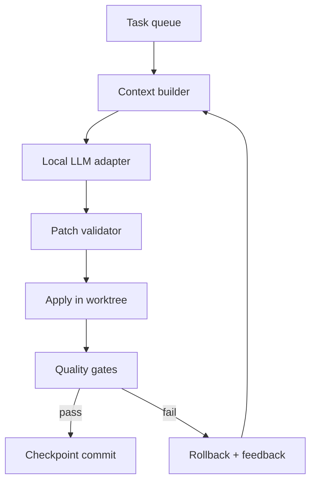

# Architecture

## Runtime game

The Godot project is intentionally dependency-free. `Main` owns race state, procedural track drawing, pickups, HUD, and four `Racer` nodes. This compact vertical slice provides a runnable baseline; later tasks should extract stable domains without changing behavior.

Recommended target modules:

| Module | Responsibility |
| --- | --- |
| RaceDirector | countdown, checkpoints, laps, finish order, restart |
| RacerController | input abstraction and CPU decisions |
| VehicleBody | arcade motion, surfaces, collision response, boost |
| TrackDefinition | path, bounds, checkpoints, spawn grid, pickup slots |
| PickupManager | spawn/collect/respawn and balancing |
| HUD | positions, lap/boost, countdown, results, focus navigation |
| SaveData | versioned settings/progression in `user://` |

Physics-affecting work runs in `_physics_process`. UI observes signals or snapshots; it must not own race truth. Input actions follow `p{n}_action`. CPU control returns the same normalized intent shape as human input.

## Autonomous system

`agent/run_loop.py` is the only orchestrator. Runtimes implement a minimal chat interface. The model returns JSON containing rationale, patch, tests, and task status. Only unified diffs within allowed paths and budgets are applied. Shell commands are fixed in configuration; the model cannot invent commands.

## Safety boundaries

- Clean worktree required by default.
- One selected task and one patch per iteration.
- Path denylist plus allowed top-level directories.
- Maximum patch size and timeout.
- Fixed test commands, no LLM-selected shell.
- Successful gates create a checkpoint; failed gates restore only the loop's patch.
- Stop file, iteration cap, wall-clock cap, and consecutive-failure cap.
- Logs contain prompts/responses and may contain source code, but never environment values.

## Web decisions

The first export disables threads. This avoids SharedArrayBuffer/cross-origin-isolation requirements and is sufficient for the scoped 2D racer. If profiling later proves threads necessary, hosting must provide secure context and cross-origin isolation headers, and browser tests must be updated.
